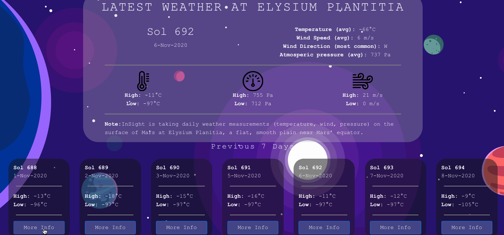

## Universe-Lovers 

Universe-Lovers is a self-motivated project between two software engineers and lovers of a universe. This project consists of several responsive projects encircling astronomy. 

### `Core functionality`  
This project consists of below three major functionalities.

#### `1. Weather at Mars' equator: Elysium Planitia` 

[NASA's InSight Mars Lander](https://www.nasa.gov/mission_pages/insight/main/index.html) is taking daily weather measurements (temperature, wind, pressure) on the surface of Mars at Elysium Planitia, a flat, smooth plain near Mars’ equator.

**Features:** 
-  Dashboard for Mars' weather
-  Switch between different available sol days

**Data:** Mars weather data is fetched from [NASA-APIs](https://api.nasa.gov/).

#### `2. International Space Station(ISS) Tracker` 

The real-time International Space Station (ISS) tracker helps to identify the current location 
of ISS and its orbit trajectory across the globe in both 2D and 3D interactive representations.

**Features:** 
-  Real-time ISS tracking 
-  ISS orbit trajectory

**Data:** Location of ISS is brought using [Open-Notify-API](http://open-notify.org/Open-Notify-API/).

#### `3. Light Pollution Map `  

Light pollution limits the visibility of milky way to the unaided eye, the visiblity of nebulae and galaxies seen in telescopes, and raises the noise on astrophotographs. Light Pollution Map allows you to easily locate dark sites where the sky will not be affected by light pollution, allowing the best observance, star gazing, and photography of the night sky!

**Features:** 
-  Visualization of Light Pollution Map in various 2D and 3D form
-  Search dark sites at particular location

**Data:** Light pollution map is built with the
[World Atlas of Artificial Night Sky Brightness dataset](https://dataservices.gfz-potsdam.de/contact/showshort.php?id=escidoc:1541893&contactform).

### `Known limitations` 
As Universe-Lovers is using `free` version of the APIs, one might run into few issues but not limited to HTTP 429 - too many requests.